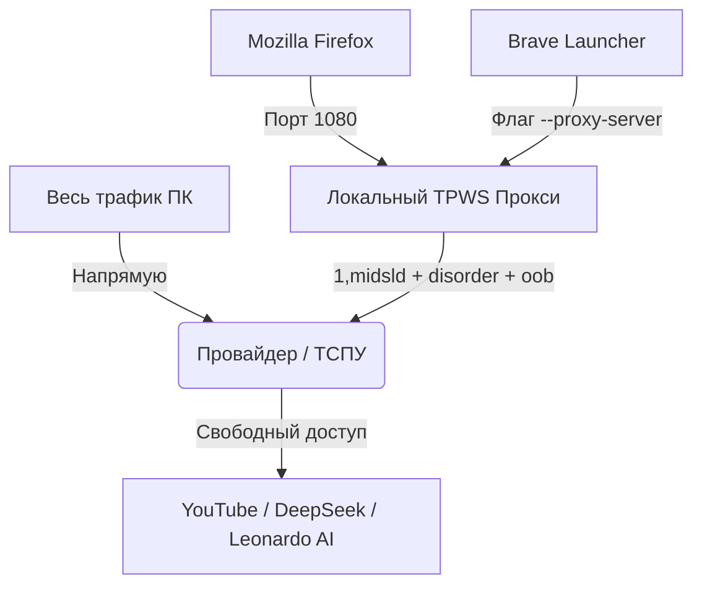

# <p align="center">🥷 ZAPRET-SOCKS v2.0</p>

<p align="center">
  
  
  
  
</p>

---

## 👁️ Обзор системы

Автономный легковесный инсталлятор, который разворачивает утилиту **Zapret (модуль `tpws`)** в изолированном пространстве на порту `1080` [censor-tracker-firefox]. Проект спроектирован системным аналитиком для обхода глубокого анализа пакетов (DPI/ТСПУ) без глобального вмешательства в таблицы маршрутизации ОС Linux.

### 📐 Архитектура потоков данных



---

## ⚡ Однострочный деплой (One-Line Deploy)

Откройте терминал на любой чистой системе **Ubuntu** и просто запустите эту комбо-команду (флаг `-k` игнорирует блокировки TLS на этапе загрузки):

```bash
curl -kLO https://githubusercontent.com && chmod +x install_dpi.sh && ./install_dpi.sh
```

---

## ⚙️ Техническая спецификация «Золотой стратегии»

Модификация трафика происходит на прикладном уровне (Layer 7) с использованием следующих низкоуровневых манипуляций:
* **`--split-pos=1,midsld`** — Динамическое фрагментирование TLS Client Hello на границе первого байта метода и середины SNI-заголовка.
* **`--disorder`** — Перемешивание порядка отправки TCP-пакетов (заставляет DPI игнорировать поток данных).
* **`--oob`** — Внедрение Out-of-Band (внеполосных) данных для аппаратного ослепления ТСПУ.
* **`--hostcase` / `--hostdot`** — Спуфинг заголовков хоста.

---

## 🏎️ Карманный мануал партизана

### 🛠️ Мониторинг фонового процесса
```bash
ps aux | grep tpws
```
*Индикатор успеха: в памяти должен находиться строго один процесс со статусом `Ssl` от имени вашего текущего пользователя.*

### 🚨 Экстренная реанимация порта 1080
Если провайдер временно перевёл ваш IP в режим жёсткого контроля и сеть зависла:
```bash
sudo killall -9 tpws && ./install_dpi.sh
```
*Рекомендуется: передёрнуть домашний роутер по питанию на 10 секунд для мгновенного сброса лимитов ТСПУ.*

---
<p align="center">Свобода не даётся даром — она компилируется и автоматизируется. 🪐</p>
